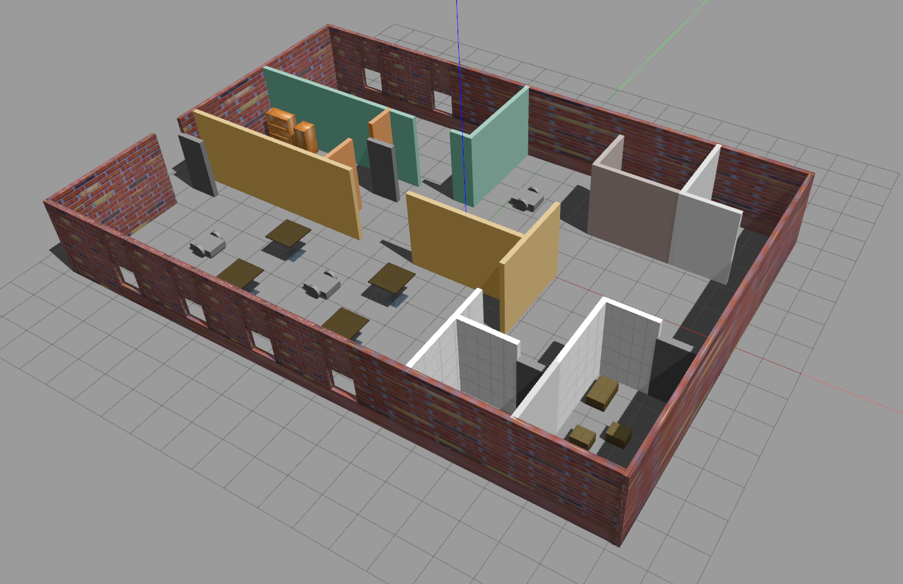

# RoboticsND_Udacity
Udacity's Robotics Software Engineer Nanodegree Program - A collection of coursework and projects submitted during the course of the program.

## Project #1: Build My World

### Description

The introductory project of Udacity's Robotics Nanodegree; It required building a simulated "world" in Gazebo that consisted of a house-like structure that houses robots to be developed in subsequent projects. A plugin was built that would execute on launching the world.

### Concepts
Concepts explored in this project:

  - Gazebo Worlds
  - Gazebo Models
  - Gazebo Plugins
  

